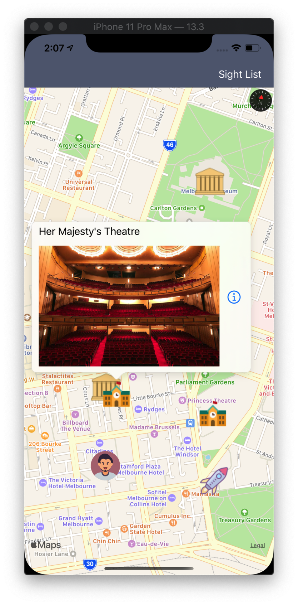
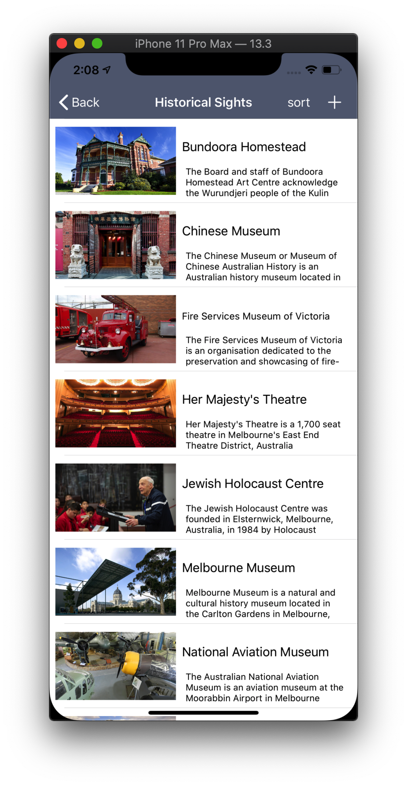
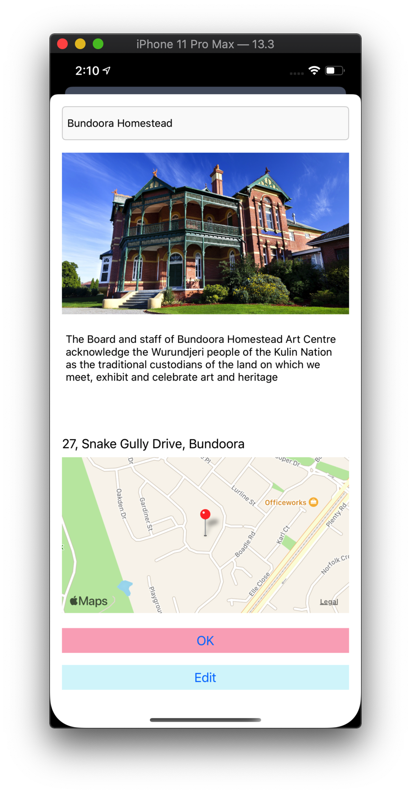
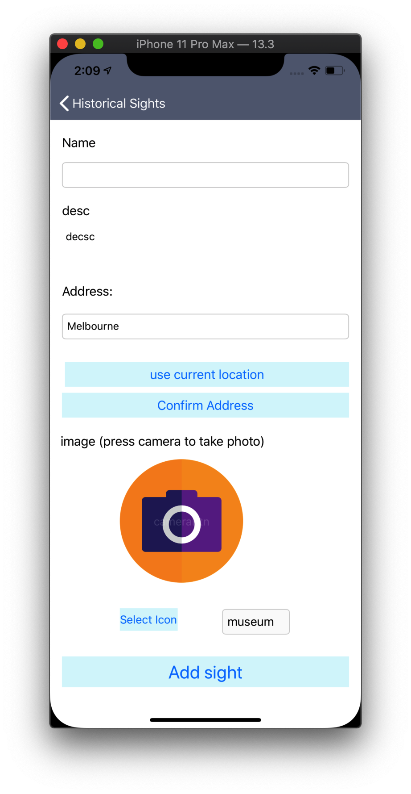
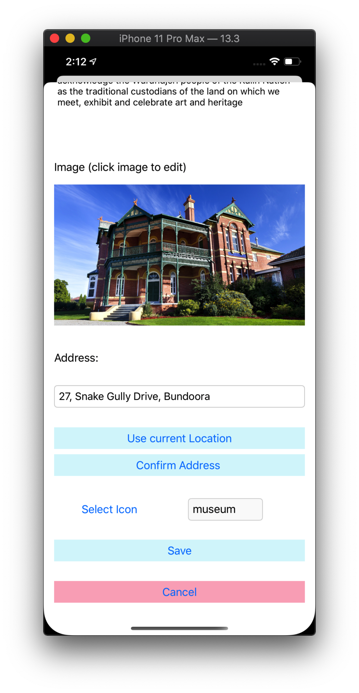

# Historical spots of Melbourne
1. home page with spot icons and annotation callout view 

2. list of spots in tableview 

3. spot detail page when click the annotation callout

4. add spot page 

5. edit spot page 

